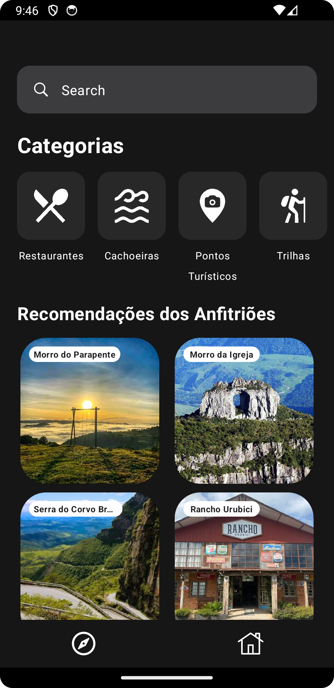
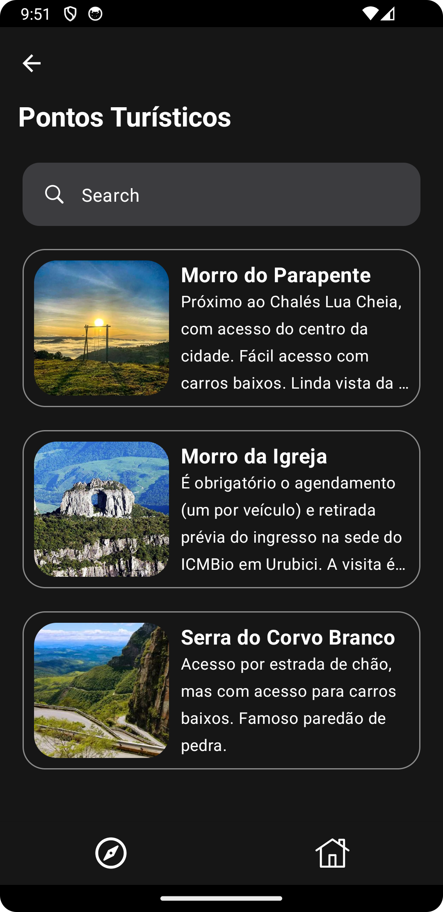
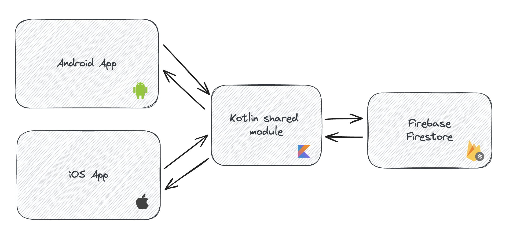
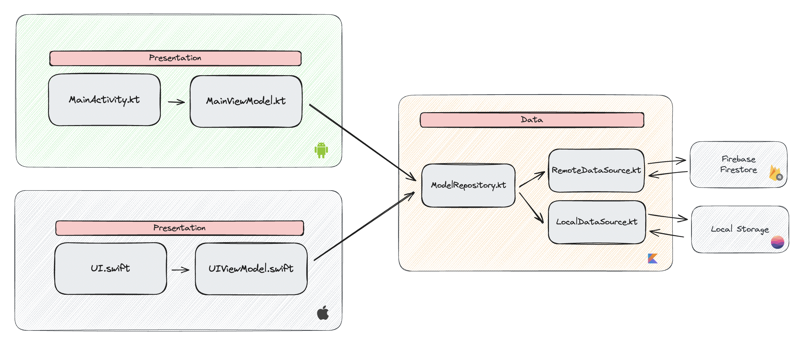

# kmp-travel-app

This project is a Kotlin Multiplatform app developed as capstone project of graduation course in
analysis and systems development at IFSC (Instituto Federal de Santa Catarina). It's an application
developed to help people to find places to visit in Urubici, a touristic city located in Santa
Catarina, Brazil.

### Android UI

<p float="left">




</p>

## 🛠 Architecture

This app was developed using the [MVVM](https://developer.android.com/topic/architecture)
architecture pattern and following
the [Clean Architecture](https://blog.cleancoder.com/uncle-bob/2012/08/13/the-clean-architecture.html)
concepts.

Currently, the structure of the system is as follows:



As a second step, is in progress improve the architecture to save the app data locally using Realm,
so the app can be used offline and we can save network resources:



## 📚 Libraries & Tools

- [KMP](https://kotlinlang.org/docs/multiplatform.html) - Shared business logic and data management
- [Jetpack Compose](https://developer.android.com/compose) - Native Android UI
- [SwiftUI](https://developer.apple.com/xcode/swiftui/) - Native iOS UI
- [Ktor](https://ktor.io/docs/client-create-multiplatform-application.html#ktor-dependencies) - Network calls
- [RealmDB](https://github.com/realm/realm-kotlin) - Local storage
- [Koin](https://insert-koin.io/docs/reference/koin-mp/kmp/) - Dependency injection
- [GitLive Firebase](https://github.com/GitLiveApp/firebase-kotlin-sdk) - KMP Support for Firestore and Storage
- [Touchlab Skie](https://skie.touchlab.co/features/flows) - `Flow` and `Coroutines` interop with Swift
- [Coil](https://github.com/coil-kt/coil) - Load images in the app

## 📝 Commits pattern

In this project we are using the [Karma](https://karma-runner.github.io/6.4/dev/git-commit-msg.html) commit convention to keep project readability.

## 🔍 Static Code Analysis
We are using [Ktlint](https://github.com/pinterest/ktlint) to standardize Kotlin code, to check, run:
```
./gradlew ktlintCheck
```
And to format, run:
```
./gradlew ktlintFormat
```
All rules you can find in `.editorconfig` file.

## 🏗️ How Build/Run the project?
### Android
First, build the project with the following command:
```
./gradlew assembleDebug
```
Then, install it on a connected device:
```
./gradlew installDebug
```
### iOS
Doc in progress...


